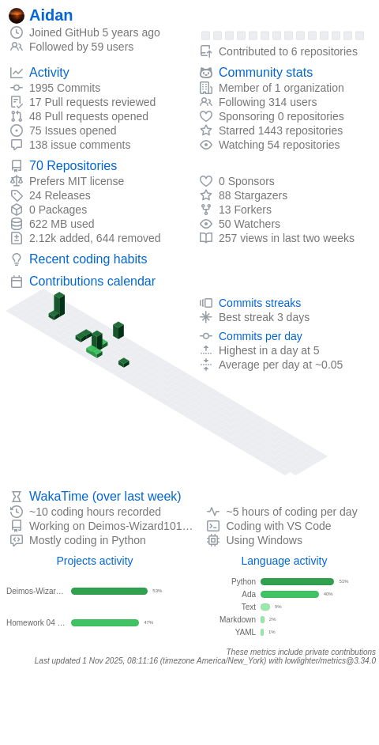

<div id="toc">
  <ul align="center" style="list-style: none">
    <summary>
      <h1>
        Hi, I'm Aidan
        
      </h1>
    </summary>
  </ul>
</div>

<div id="toc">
  <ul align="center" style="list-style: none">
    <summary>
      <h2 align="center">
        
      </h2>
    </summary>
  </ul>
</div>

_I am a self-learner, programmer, and computer science student. I spend my free time working on side projects! You can contact me through my PGP key below! :)_

<p align='center'>
  <a href="https://keybase.io/codebyaidan">
    
  </a>
</p>

<p align="center">
  
  
  
</p>

<div align="center">
  <h1><i>Stats</i></h1>

[](https://git.io/streak-stats)

  <h2><i>Activity Graph</i></h2>

[](https://github.com/CodeByAidan/)

</div>

<div align="center">
  <h2><i>Top Languages</i></h2>
  <h6>Note: Top languages is only a metric of the languages my public code consists of and doesn't reflect experience or skill level.</h6>
</div>

<!--START_SECTION:waka-->

```txt
From: 07 April 2025 - To: 14 April 2025

Total Time: 1 hr 50 mins

Markdown   1 hr 49 mins    >>>>>>>>>>>>>>>>>>>>>>>>>   99.29 %
INI        0 secs          -------------------------   00.31 %
Text       0 secs          -------------------------   00.29 %
Other      0 secs          -------------------------   00.11 %
```

<!--END_SECTION:waka-->

<!-- corny...
```json
{ 
	"Languages": {
		"Assembly (NASM/x86)": "Beginner",
		"C": "Beginner",
		"C++": "Beginner",
		"Haskell": "Beginner",
		"HTML5": "Advanced",
		"Java": "Intermediate",
		"JavaScript": "Intermediate",
		"LaTeX": "Intermediate",
		"PHP": "Beginner",
		"Powershell": "Intermediate",
		"Python": "Advanced",
		"R": "Intermediate",
		"Rust": "Beginner",
		"Shell": "Beginner",
		"SQL": "Intermediate",
		"TypeScript": "Intermediate"
	},
	"IDEs": [
		"Arduino IDE",
		"CLion",
		"IntelliJ IDEA",
		"Juypter Notebook",
		"NeoVim",
		"Obsidian",
		"PyCharm",
		"RStudio",
		"RustRover",
		"Visual Studio Code",
		"Visual Studio"
	]
}
```
-->

<div align="center">
  <h2><i>Tools and Technologies</i></h2>
</div>

### 💾 Databases


### 📚 Frameworks, Platforms, and Libraries


### ☁️ Hosting/SaaS


### 🖥️ ML/DL


### 🎛️ Operating Systems


<p align="center">
    
</p>
